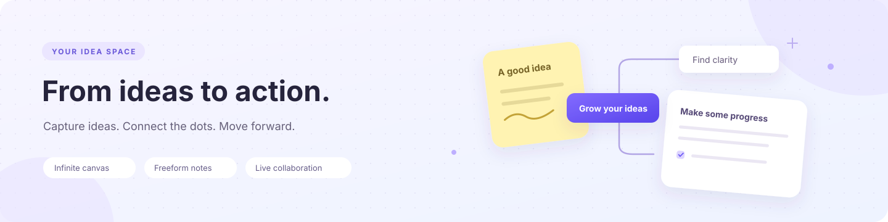

<div align="center">
  
  <h1>Museboard</h1>
  <p><a href="README.md">简体中文</a> · <strong>English</strong></p>
  <p><strong>Your ideas, notes, and team collaboration in one workspace.</strong></p>
  <p>Infinite canvas · Freeform notes · Mind maps and connectors · Real-time collaboration</p>
  <p>
    <a href="https://nodejs.org/en"></a>
    <a href="https://developer.mozilla.org/en-US/docs/Web/JavaScript/Guide/Modules"></a>
    <a href="https://www.sqlite.org/wal.html"></a>
    <a href="#quick-start"></a>
  </p>
  <p>
    <a href="https://github.com/commonDomain/board/stargazers"></a>
    <a href="LICENSE"></a>
    <a href="https://github.com/commonDomain/board/issues"></a>
  </p>
  <p>
    <a href="#quick-start">Quick start</a> ·
    <a href="#showcase">Screenshots and demo</a> ·
    <a href="#features">Features</a> ·
    <a href="#configuration">Configuration</a> ·
    <a href="#documentation">Documentation</a>
  </p>
</div>

<p align="center">
  
</p>

Museboard is a collaborative workspace you can host yourself. Capture ideas with sticky notes and drawing tools, connect them with mind maps and connectors, and keep reference material, discussions, and next steps in freeform notes.

<a id="showcase"></a>

## Screenshots and demo

<p align="center">
  
</p>

<p align="center"><sub>Recorded in the app: explore an idea board → zoom into connections → switch to notes and action items. The recording uses sample content in an isolated environment. Screenshots and the recording show the Chinese interface.</sub></p>

<details>
<summary><strong>View full canvas and notebook screenshots</strong></summary>

### Canvas: give every idea a place

Sticky notes fit inside their frame, with a separate mind map area for relationships. Groups, spacing, and tool access remain easy to see.


### Notebook: keep the discussion moving

Organize information into sections and pages. Combine text, lists, and tables, or copy canvas material into a note to develop it further.


</details>

<a id="features"></a>

## Features

| Area | What it provides | Use it for |
| --- | --- | --- |
| **Canvas** | Pressure-sensitive drawing, sticky notes, text, shapes, frames, and layers | Capturing ideas, sketching, and visual organization |
| **Notes** | Sections, pages, rich text, tables, copied material, and region references | Project notes, reference material, and discussions |
| **Mind maps** | Editable nodes, relationships, smart routing, and XMind / Markdown import | Breaking down ideas and explaining structure |
| **Collaboration** | Account canvases, sharing groups, live cursors, edit locks, and private content | Working together while retaining personal space |
| **Planning** | Checklists, boards, calendars, task sources, and execution steps | Turning information into next steps; enabled with a feature flag |
| **Storage** | SQLite persistence, a local pending-operation queue, exports, and full backups | Saving work, recovering from disconnections, and managing your data |

Account canvases are shared with group members by default and can be made private. Guest data stays in the current browser and can optionally be imported after signing in.

<details>
<summary>View the full feature list</summary>

- Infinite canvas with zoom and pan, supporting mouse, touch, and pressure-sensitive pens.
- Canvas 2D brush engine with distinct brushes and controls for smoothing, pressure, grain, spacing, and opacity.
- Shapes, text, sticky notes, tables, images, connectors, selection, and transforms.
- Layer creation, deletion, ordering, visibility, locking, opacity, and blending.
- Editable mind maps with node creation, deletion, editing, folding, local XMind / Markdown import, and an optional official XMind MCP connection.
- Background presets and a sticker library; backgrounds synchronize as canvas settings.
- Desktop QR sign-in: scan with a phone, authenticate with a local Passkey, and explicitly authorize the desktop. The Windows page does not invoke a sign-in Passkey, so this flow does not trigger the site's Windows Hello / USB security-key selector.
- Discoverable Passkey registration, mobile sign-in, credential management, absolute 14-day sessions, and recovery-code resets.
- Server persistence for account canvases; guest canvases and image Blobs remain in the browser and can be selectively imported into an account.
- Long-lived sharing groups joined using a sharing code: an owner and up to four members. Shared canvases support live collaboration; private canvases are visible only to their owner.
- Share an individual note from its context menu using the canvas sharing group. The shared-notes entry below favorites lists notes shared by you and other members; these also appear in all notes. Labels identify notes you shared or received from a member. Members can edit a note's content and title after acquiring its edit lock. The owner manages sharing, moves, and deletion. Unshared notes and images stay private.
- Each account or guest can own up to 10 regular canvases. Group members can see up to 50 regular canvases plus their own guide, with individual directory ordering.
- Every account or guest receives a private guide on its first directory read, including existing users. No script is needed. The guide can be edited, renamed, or deleted independently; deletion does not recreate it. Deleting the last canvas opens the canvas-creation screen. The guide cannot be shared and does not count toward the 10-canvas limit. Its template is `public/guide-template.json`; editing one user's copy does not change another's.
- Profiles, avatars, immutable account IDs, member lock-chain controls, sharing-removal confirmation, and a privacy blur after 15 minutes of inactivity.
- WebSocket collaboration, account-level presence deduplication, live cursors, undo / redo, and manual saving.
- Frames / sections with creation, dragging, resizing, folding, child-content locking, export, and safe or cascading deletion.
- Nested groups; moving a group preserves its subtree, while ungrouping promotes children by one level.
- A content navigator showing frames > groups > objects, with locate, visibility, lock, rename, delete, and frame ordering controls.
- Global search across directory canvases for text, sticky notes, frames, and groups, with navigation to matching content.
- Navigation cards for 2D Amap street maps, place search, and route planning. Selected places, locations, and routes synchronize as canvas state.
- Six alignment modes, horizontal / vertical distribution, grid layout, and connector-aware flow layouts computed in a Worker.
- Browser spatial indexes for viewport culling, hit testing, and snapping; server FTS5 and RTree derived indexes.
- Responsive toolbars and panels, including a touch-friendly bottom toolbar on mobile.
- Resend email magic-link registration, sign-in, and account email binding. Email addresses are private account data, excluded from public user objects, sharing groups, and presence.

Evaluate suitability for your workflow in the current browser. This document does not guarantee compatibility that has not been covered by automated or physical-device testing.

</details>

<a id="quick-start"></a>

## Quick start

Requires **Node.js 24+** and npm. You can start locally in guest mode.

```bash
git clone https://github.com/commonDomain/board.git
cd board
npm ci
cp .env.example .env
npm start
```

Open **[http://localhost:4000](http://localhost:4000)** and select the option to continue as a guest.

On Windows PowerShell, use `Copy-Item .env.example .env` instead of `cp`. `npm start` automatically builds browser dependencies and frontend components.

<details>
<summary>Browser and device requirements</summary>

- Node.js 24 or later; the server uses built-in `node:sqlite`.
- A modern browser supporting WebAuthn, WebSocket, Canvas 2D, and IndexedDB.
- npm.

Responsive layouts and touch interactions accommodate desktop browsers, mobile browsers, and WeChat Mini Program `web-view`. The repository does not include a standalone Mini Program project. WeChat behavior depends on the WeChat version, system WebView, and storage quotas; verify on your target physical devices before release.

</details>

<a id="configuration"></a>

## Configuration

Start with canvases and notes, then enable optional integrations as needed. Store configuration in your local `.env`; see the full [configuration template](.env.example).

| Feature | Default | How to enable it |
| --- | --- | --- |
| Guest canvases and notes | Enabled | No third-party service needed; data stays in the current browser |
| Passkeys and QR authorization | Enabled | Use localhost locally; configure your HTTPS domain and RP ID in production |
| Email magic links | Disabled | Configure Resend and set `EMAIL_AUTH_ENABLED=1` |
| Embedded planning | Disabled | Set `PLANNING_ENABLED=1`; see [planning](docs/planning.md) |
| Amap | Disabled | Configure Amap credentials and set `AMAP_ENABLED=1` |
| XMind cloud connection | Disabled | Configure a token-encryption key and set `XMIND_MCP_ENABLED=1` |

<a id="documentation"></a>

## Documentation

The linked technical documents currently use Chinese.

| Topic | Start here |
| --- | --- |
| Source entry points, module responsibilities, builds, and checks | [Code maintenance](docs/code-maintenance.md) |
| Canvas / notebook interface and architecture | [Current UI and architecture](docs/current-ui-and-architecture.md) |
| Collaboration, operation queues, and commit acknowledgments | [Synchronization](docs/sync-mechanism.md) |
| Connectors, endpoints, and compatibility rules | [Connector system](docs/connector-system.md) |
| Planning components and data lifecycle | [Planning](docs/planning.md) |
| Note storage, permissions, and recovery | [Notebook reliability](docs/notes-workspace-reliability.md) |
| Phone and tablet interactions | [Mobile adaptation](docs/mobile-adaptation.md) |

<details>
<summary><strong>Deployment, configuration, and data maintenance</strong></summary>

## Deployment and configuration

The root `.env` stores dynamic configuration and is excluded by `.gitignore`. Copy `.env.example` and fill in your deployment values. `npm start` builds browser dependencies and frontend components, then loads configuration through Node.js `--env-file-if-exists=.env` and starts the server. Environment variables explicitly provided by your operating system or process manager take precedence over `.env`.

The default listening address is `0.0.0.0:4000`:

```text
http://localhost:4000/
```

Production Passkeys require HTTPS. For your deployment domain, configure:

```text
PUBLIC_BASE_URL=https://example.com/board/
PASSKEY_RP_ID=example.com
PASSKEY_EXPECTED_ORIGIN=https://example.com
ALLOWED_ORIGINS=https://example.com
```

Email registration and sign-in are disabled by default. Once Resend is configured, email becomes the preferred sign-in method; Passkeys and recovery codes appear under the other sign-in options:

```text
EMAIL_AUTH_ENABLED=1
RESEND_API_KEY=re_...
RESEND_FROM=Museboard <login@example.com>
RESEND_WEBHOOK_SECRET=whsec_...
```

Verify the sender domain matching `RESEND_FROM` in Resend, create an API key scoped to sending email, and configure the webhook URL as `https://example.com/api/webhooks/resend`. Subscribe to at least `email.sent`, `email.delivered`, `email.delivery_delayed`, `email.bounced`, `email.complained`, and `email.failed`. The webhook does not depend on a browser Origin; every request verifies the Resend / Svix signature against the raw body. Do not rewrite the body in a CDN or proxy. Keep `RESEND_API_KEY` and `RESEND_WEBHOOK_SECRET` in the server's secret environment only.

Magic links expire after 15 minutes and can be confirmed once. Tokens appear only in the URL fragment and are removed from the address bar after page load; the database stores only SHA-256 hashes. The link page confirms email control without creating a session, setting a sign-in cookie, or providing an entry into the board. The requesting tab holds a separate claim token and polls for confirmation; only that tab can establish the session. To sign in on a phone, initiate the email request in that phone's browser. Signing in does not silently create an unknown account. Registering an existing email returns to its account; binding an email does not automatically merge accounts. Switching from an already signed-in account requires explicit confirmation on the originating page.

### Amap navigation

Navigation is disabled by default. Create a Web JS API key and a Web Service key in the Amap console, configure the applicable domain / IP restrictions and digital signatures, and set:

```text
AMAP_ENABLED=1
AMAP_JS_KEY=your_web_js_api_key
AMAP_JS_SECURITY_CODE=your_js_api_security_secret
AMAP_WEB_SERVICE_KEY=your_web_service_key
AMAP_WEB_SERVICE_PRIVATE_KEY=your_web_service_signing_private_key
AMAP_USAGE_HASH_SECRET=an_independent_random_secret_of_at_least_32_characters
```

The server refuses to start when enabled with missing keys, an anonymization secret shorter than 32 characters, or an invalid quota-reset timezone. The JS key appears only in the authenticated same-origin sandboxed map frame. The JS security secret is injected by the same-origin `/_AMapService` proxy and is not sent to the browser. Search, suggestions, location, and route planning use signed server requests. Route fields show up to eight detailed suggestions after 320 ms without input; choose with mouse, touch, or keyboard. Submitting without choosing a suggestion still falls back to a full-text place search. Business endpoints require authentication, canvas access, and CSRF protection; quotas are tracked by account, HMAC-anonymized IP, and globally.

By default, each canvas supports one card of each navigation type, and each account can create three of each type. Account search quotas are 40/day and 800/month; route planning 30/day and 600/month; location 50/day and 1,000/month. IP and global quotas, minute rate limits, global QPS, concurrency, timeouts, response limits, caching, and circuit breakers are also configurable. See `.env.example` for the complete variables and defaults. Saved results remain readable when quota is exhausted or the upstream service is unavailable.

### WPS cloud documents (optional)

The repository includes WPS WebOffice SDK 2.0.7 at `public/vendor/web-office-sdk-solution-v2.0.7.umd.js` for WPS document embedding. See the [official SDK documentation](https://open.wps.cn/documents/app-integration-dev/docs-center/online-preview-edit/web/jssdk) for usage.

### Mind-map import and XMind MCP

`.xmind` files are unpacked and parsed entirely in a browser Worker, supporting modern `content.json` and XMind 8 `content.xml`. Original files are not uploaded, cached, or written to IndexedDB. Markdown uses a separate parser. Both imports enforce file-size, node-count, and depth limits, and failures leave the board unchanged.

The XMind cloud connection is disabled by default and uses official Streamable HTTP MCP with OAuth authorization codes and PKCE. Users can choose the international endpoint `https://app.xmind.com/api/mcp` or the Chinese endpoint `https://app.xmind.cn/api/mcp`. An account retains authorization for one site; successfully switching replaces the previous credentials. Generate an independent 32-byte key and keep it in the server secret environment before enabling:

```text
XMIND_MCP_ENABLED=1
XMIND_TOKEN_ENCRYPTION_KEY=a_base64_encoded_random_32_byte_key
XMIND_TOKEN_ENCRYPTION_PREVIOUS_KEYS=comma_separated_previous_keys_during_rotation
```

Access and refresh tokens are stored only as AES-256-GCM ciphertext in account records, never in the browser, board JSON, shared-member responses, or logs. Members can see content already placed on a shared board, but only the connector authorized for the same site can browse recent remote files, refresh, or confirm write-back. Reading prefers structured topics, styles, and relations. Writing uses JSON incremental patches with stable IDs and available fine-grained topic / style tools, followed by read-back validation. Hierarchical Markdown is a fallback only when upstream tools do not support imperative editing. Boundaries, summaries, images, attachments, tasks, and unknown fields untouched on the canvas are explicitly requested to remain intact. For key rotation, make the new key primary and temporarily retain old keys in the previous-key list. Store keys separately from database backups. See `.env.example` for timeout and response limits.

For local Passkey development, set `PUBLIC_BASE_URL`, `PASSKEY_RP_ID`, `PASSKEY_EXPECTED_ORIGIN`, and `ALLOWED_ORIGINS` to `http://localhost:4000/`, `localhost`, `http://localhost:4000`, and `http://localhost:4000`, respectively. On startup, the sign-in dialog appears. Desktop account creation, Passkey sign-in, and recovery display a QR code: scan with a phone camera, use the phone browser's Passkey, and confirm authorization of the desktop. Compare the six-digit verification code on both screens. QR authorization expires after five minutes and is single-use. You can explicitly continue as a guest; signing out does not automatically open a guest workspace.

The phone authorization token is in the URL fragment, excluded from static-page requests. The phone immediately moves it into that tab's `sessionStorage` and clears the address bar. The desktop polls with a separate claim token. The database stores only SHA-256 hashes of both tokens.

Authenticated accounts load canvases they can access. If shared canvases exist, they can be opened directly; if none are accessible, the app prompts creation of the first canvas. Leaving or being removed from a group also opens that prompt when no owned canvas remains; no canvas is created automatically. Legacy `?board=` and hash entries are ignored, and historical records outside the directory are not automatically exposed.

Canvas directory endpoints:

- `GET /api/canvases`: read the directory ordered by creation time.
- `POST /api/canvases`: create a canvas with JSON `{ "name": "Name" }`.
- `PUT /api/canvases/:id/preview`: write a WebP thumbnail.
- `GET /api/canvases/:id/preview?v=...`: read a versioned thumbnail.
- `GET /api/search?q=...&limit=...&cursor=...`: search directory canvases, returning up to 50 results.

Canvas names are trimmed, limited to 30 Unicode characters, and checked for duplicates with case-sensitive exact matching. An account can own up to 10 canvases; canvases owned by other group members do not count toward that limit.

### Account and guest data boundaries

- Usernames are non-unique display names; `MB-…` account IDs are globally unique and immutable.
- Recovery codes are displayed only on creation or regeneration; the database stores a random salt and `scrypt` hash.
- Account REST, preview, asset, and WebSocket requests validate membership and canvas visibility on the server. Making a canvas private immediately revokes other members' connections.
- Guest mode does not connect a collaboration WebSocket or request server canvas, search, or asset endpoints. Guest data cannot be recovered after clearing site data or switching browsers.
- After signing in, guests can optionally import local canvases. Imports are private by default, and a guest copy is deleted only after successful server commit.

### Document migrations

On the first startup after upgrading, the server migrates directory canvas documents from v2, v3, or v4 to v5 in one SQLite transaction. Original JSON is archived by source version in `state_v2_archives`, `state_v3_archives`, or `state_v4_archives` for auditing and manual rollback. The transaction commits only after every canvas passes validation. v5 adds shared notes, note ordering, independent layouts, and pending-placement state while preserving canvas geometry. A corrupt canvas rolls back the entire migration and prevents startup. Search, spatial, map-component, and asset-reference derived data is rebuilt with implementation-version markers, so later normal startups skip full rebuilding.

Before deployment, stop the old service and make a complete `DATA_DIR` backup. Version archives do not replace production backups.

### Notebook mode

The canvas / notebook switch opens a separate notebook workspace. Notebooks, sections, pages, and rich text are stored independently. Copy canvas material or original note content between modes, then edit the copies separately; they do not share elements or coordinates. Existing freeform note layouts remain consistent across devices and can be viewed with fit-to-page, 100% reset, scrolling, and zoom.

### Tablet and phone interactions

Layouts prioritize iPad and Android tablets, supporting orientation changes and split-screen. Phones use a bottom toolbar, scrollable menus, and a directory drawer. Touch targets and selection handles have enlarged hit areas, and zoom controls do not cover the toolbar.

- Use two fingers to pan and zoom canvases or notes. Canvas rotation is off by default; enable it in touch settings and reset the angle with the straighten control.
- Finger drawing is enabled by default. With pen-only drawing enabled, fingers navigate while drawing tools are active. The setting is stored locally and shared across both modes.
- Tap a blank note area to type and swipe to browse. Move or resize selected content using handles. Touch controls are available for multi-selection, completing edits, cancellation, and directory ordering.
- Tap to confirm placement of text and similar canvas objects; swiping does not immediately create content. Selected content exposes editing and additional actions in the touch action bar.
- Spreadsheets scroll with one finger and edit cells with a double tap. Switch to range selection with the drag-selection control, and long-press for the cell menu.
- Adding a second finger cancels an unfinished stroke and switches to view navigation. System gesture cancellation does not commit unfinished strokes or transforms.

See [mobile adaptation and acceptance](docs/mobile-adaptation.md) for implementation and verification scope. Browser touch emulation covers the main interactions; pen input, system keyboards, file picking, and downloading still require physical-device acceptance on iPad and Android.

Temporarily override configuration in PowerShell:

```powershell
$env:PORT = '8080'
$env:DATA_DIR = 'D:\museboard-data'
npm start
```

## Data reliability

### Server: SQLite WAL is the source of truth

Board state is stored in `DATA_DIR/whiteboard.sqlite`. The database uses:

- WAL journal mode.
- `synchronous=FULL`.
- Foreign-key constraints.
- Write transactions and revision compare-and-swap.

Canvas directory entries and previews also live in SQLite. Only directory canvases can join collaboration rooms. Historical `boards` records remain stored but are not reopened through legacy URLs.

Each valid operation updates the authoritative snapshot, operation log, full-text search documents, and spatial bounds in one transaction. The server commits before broadcasting the result. Invalid batches are rejected entirely. State JSON is the recovery source; FTS5 / RTree are rebuildable indexes, never the only copy of your data.

The server normalizes and validates frame, group, and object references and parent relationships. Invalid references, group cycles, excessive nesting, edits to locked content, and protocol mismatches are rejected. Cascading deletion pins cross-boundary connector endpoints to their positions before deletion in the same commit, avoiding dangling references.

`whiteboard.sqlite-wal` and `whiteboard.sqlite-shm` are normal SQLite runtime files. Do not copy, delete, or modify them individually while the service runs. Prefer stopping the service and copying the complete `DATA_DIR`, or use SQLite's supported online backup mechanism.

### WebSocket v4 revision / opId protocol

- `opId`: a client-generated unique operation ID. The server deduplicates `(boardId, opId)`, so retries do not reapply changes.
- `baseRevision`: the revision an operation is based on. A mismatch rejects the commit; the client fetches a fresh snapshot and replays pending operations.
- `revision`: increases with each successful commit.
- `committed`: an authoritative acknowledgment after commit, containing normalized operations and the new revision.
- `snapshot` / `resync`: full reconciliation on joining or after a conflict.
- `save`: checkpoints the committed revision and returns `savedAt`.

The server serializes operations per board, committing the operation log and snapshot in the same SQLite transaction.

### Browser: IndexedDB outbox

Operations awaiting a `committed` acknowledgment are stored in the browser's `museboard-client` IndexedDB database. After disconnection or reload, the client resends the outbox; `opId` makes retries idempotent.

The latest account snapshot is cached by `userId + boardId` for fast recovery. Pending operations are persisted before leaving. On sign-out or session expiry, they remain in that account's isolated recovery area and resume when the same account signs in. They are never copied to another account or the guest workspace. Outbox entries are removed only after server acknowledgment. Guest directories, snapshots, and image Blobs use separate IndexedDB storage. When IndexedDB is unavailable, the app reports temporary memory-only mode and offers export.

Browser caches do not replace server data. SQLite remains authoritative for collaboration state.

### HTTP and server memory caching

- HTML uses `no-cache` and ETags to check the current build. JS, CSS, Worker, and vendor URLs in HTML receive a frontend build content fingerprint and one-year `immutable` caching. Restart the service after publishing changes to recalculate fingerprints.
- Canvas previews use private immutable caching only when the URL's `v` matches the current version. Unversioned URLs revalidate, and stale versions do not return new content. Image assets use SHA-256 content addresses, `private` caching, and `Vary: Cookie`, excluding shared proxy caches and cross-session reuse.
- The server caches recently loaded board state. Boards with clients, pending writes, or deletion in progress are not evicted. Idle boards use LRU eviction by age, entry count, and estimated bytes; authoritative state is already committed to SQLite. The `boardCache` field in `GET /api/health` reports hits, misses, evictions, and capacity.

## Document and protocol boundaries

The server accepts WebSocket protocol v4 only. Older clients receive an explicit protocol mismatch and must refresh. Document storage versions are separate from the WebSocket protocol; see the migration section above for conversion to v5. Historical temporary canvases outside the directory are neither exposed nor deleted. Legacy `?board=` and hash values are ignored rather than used to select a canvas.

## Data directory

The default is the root `data` directory. Use `DATA_DIR` to choose a separate persistent disk:

```text
data/
├── whiteboard.sqlite       # Authoritative state, directory, operations, archives, indexes
├── whiteboard.sqlite-wal   # SQLite WAL runtime file
├── whiteboard.sqlite-shm   # SQLite shared-memory runtime file
├── assets/                 # Uploaded images deduplicated by content hash
└── logs/                   # Current day's login audit: login-users-YYYY-MM-DD.log
```

The service user needs write access to `DATA_DIR`. Monitor its capacity and backups.

## Environment variables

| Variable | Default | Description |
| --- | ---: | --- |
| `PORT` | `4000` | HTTP / WebSocket port |
| `HOST` | `0.0.0.0` | Listening address |
| `DATA_DIR` | `<project>/data` | SQLite and asset directory |
| `LOGIN_LOG_DIR` | `<DATA_DIR>/logs` | Login audit logs; retain only the current day's file |
| `LOGIN_LOG_TIMEZONE` | `Asia/Shanghai` | Timezone for daily log rotation |
| `API_PAYLOAD_ENCRYPTION_ENABLED` | `0` | Enable application-layer AES-256-GCM for same-origin JSON API with `1`; HTTPS is still required |
| `API_PAYLOAD_ENCRYPTION_KEY` | Empty | Server's base64-encoded 32-byte primary key; not stored in the browser |
| `API_PAYLOAD_ENCRYPTION_SESSION_TTL_MS` | `600000` | ECDH / HKDF-derived temporary API encryption session lifetime |
| `API_PAYLOAD_ENCRYPTION_MAX_SESSIONS` | `10000` | Maximum retained API encryption sessions |
| `API_PAYLOAD_ENCRYPTION_CLOCK_SKEW_MS` | `60000` | Allowed clock skew and replay-nonce window |
| `MAX_ENCRYPTED_API_PAYLOAD` | `100663296` | Maximum encrypted envelope size in bytes |
| `PUBLIC_BASE_URL` | `http://localhost:4000/` | Public base URL for Passkeys |
| `PASSKEY_RP_ID` | Hostname of `PUBLIC_BASE_URL` | WebAuthn RP ID without scheme or path |
| `PASSKEY_EXPECTED_ORIGIN` | Origin of `PUBLIC_BASE_URL` | Exact WebAuthn origin |
| `PASSKEY_RP_NAME` | `Muse Board` | RP name displayed by the browser |
| `PASSKEY_AUTH_ENABLED` | `1` | Enable Passkey sign-in, registration, recovery, and management |
| `REGISTRATION_ENABLED` | `1` | Enable new accounts without affecting existing sign-ins |
| `GUEST_MODE_ENABLED` | `1` | Show the guest entry on the sign-in screen |
| `SHARING_ENABLED` | `1` | Enable sharing management and cross-account shared canvas access |
| `SHARING_MAX_MEMBERS` | `5` | Maximum members per sharing group |
| `SESSION_TTL_MS` | `1209600000` | Absolute session lifetime: 14 days |
| `MAX_SESSIONS_PER_ACCOUNT` | `20` | Maximum active sessions per account; older sessions are evicted |
| `MAX_PASSKEYS_PER_ACCOUNT` | `10` | Maximum saved Passkeys per account |
| `AUTH_CHALLENGE_TTL_MS` | `600000` | One-time Passkey challenge lifetime |
| `RECENT_AUTH_TTL_MS` | `300000` | Lifetime of one-time, session- and operation-bound verification before adding a sign-in method |
| `DEVICE_PAIRING_TTL_MS` | `300000` | Phone QR authorization lifetime |
| `EMAIL_AUTH_ENABLED` | `0` | Enable Resend email registration, sign-in, and binding with `1` |
| `RESEND_API_KEY` | Empty | Server-side Resend API key, required for email authentication |
| `RESEND_FROM` | Empty | Verified Resend sender, e.g. `Museboard <login@auth.example.com>` |
| `RESEND_REPLY_TO` | Empty | Optional reply-to address |
| `RESEND_WEBHOOK_SECRET` | Empty | Resend webhook signing secret, required for email authentication |
| `RESEND_MAX_ATTEMPTS` | `3` | Maximum attempts for transient delivery failures |
| `RESEND_RETRY_BASE_MS` | `350` | Base delay for Resend exponential backoff |
| `RESEND_REQUEST_TIMEOUT_MS` | `10000` | Resend request timeout |
| `EMAIL_LINK_TTL_MS` | `900000` | Magic-link lifetime; constrained to 1–60 minutes |
| `EMAIL_RESEND_COOLDOWN_MS` | `60000` | Resend cooldown per email and purpose; constrained to 10 seconds–60 minutes |
| `EMAIL_HOURLY_LIMIT` | `5` | Hourly sending limit per email |
| `EMAIL_REQUEST_RETENTION_MS` | `86400000` | Email authentication request retention |
| `RESEND_EVENT_RETENTION_MS` | `2592000000` | Resend webhook event deduplication retention |
| `MAX_CLIENTS_PER_BOARD` | `25` | Maximum WebSocket connections per board; presence is still deduplicated by account |
| `MAX_WEBSOCKET_CLIENTS` | `500` | Maximum WebSocket connections across the service |
| `MAX_ASSET_SIZE` | `15728640` | Maximum bytes per uploaded asset |
| `MAX_IMAGE_PIXELS` | `80000000` | Maximum decoded image pixels |
| `MAX_AVATAR_SIZE` | `5242880` | Maximum avatar upload bytes |
| `MAX_AVATAR_PIXELS` | `20000000` | Maximum decoded avatar pixels |
| `AVATAR_OUTPUT_SIZE` | `256` | Output avatar width and height in pixels |
| `AVATAR_UPLOAD_RATE_LIMIT` | `6` | Avatar processing limit per account and IP within the window |
| `AVATAR_UPLOAD_RATE_WINDOW_MS` | `60000` | Avatar rate-limit window |
| `IMAGE_PROCESSING_CONCURRENCY` | `2` | Sharp / libvips image processing concurrency |
| `MAX_CANVASES` | `10` | Canvas limit per account or guest |
| `MAX_CANVAS_NAME_LENGTH` | `30` | Maximum Unicode characters per canvas name |
| `MAX_PREVIEW_SIZE` | `524288` | Maximum canvas preview bytes |
| `MAX_BOARD_ITEMS` | `5000` | Maximum objects per board |
| `MAX_SECTIONS` | `500` | Maximum frames per board |
| `MAX_GROUPS` | `1000` | Maximum groups per board |
| `MAX_GROUP_DEPTH` | `16` | Maximum group nesting depth |
| `SEARCH_RESULT_LIMIT` | `50` | Maximum search results per request |
| `MAX_STATE_BYTES` | `25165824` | Maximum serialized board state bytes |
| `BOARD_CACHE_MAX_ENTRIES` | `100` | Soft limit on cached boards; active boards and pending writes are not evicted |
| `BOARD_CACHE_MAX_BYTES` | `268435456` | Soft limit on server board-cache bytes |
| `BOARD_CACHE_IDLE_MS` | `900000` | Idle lifetime for boards without clients |
| `BOARD_CACHE_SWEEP_MS` | `60000` | Board-cache sweep interval |
| `MAX_MESSAGE_SIZE` | Calculated automatically | Maximum WebSocket message size |
| `MAX_CLIENT_QUEUE_BYTES` | `33554432` | Maximum outbound buffer bytes per client |
| `MAX_CLIENT_INBOUND_QUEUE_BYTES` | `50331648` | Maximum queued inbound message bytes per client |
| `MAX_CLIENT_INBOUND_MESSAGES` | `64` | Maximum queued inbound messages per client |
| `HEARTBEAT_INTERVAL_MS` | `30000` | WebSocket heartbeat interval |
| `MAX_HTTP_CONNECTIONS` | `1000` | Maximum concurrent HTTP connections |
| `MAX_REQUESTS_PER_SOCKET` | `100` | Maximum requests per keep-alive connection |
| `HTTP_HEADERS_TIMEOUT_MS` | `15000` | HTTP header timeout |
| `HTTP_REQUEST_TIMEOUT_MS` | `30000` | HTTP request timeout |
| `HTTP_KEEP_ALIVE_TIMEOUT_MS` | `5000` | Idle keep-alive lifetime |
| `MAX_DATA_DIR_BYTES` | `21474836480` | Soft data-directory limit; new writes pause at the limit |
| `MIN_FREE_DISK_BYTES` | `1073741824` | Minimum free disk space |
| `MAX_PROCESS_RSS_BYTES` | `805306368` | Soft Node RSS limit; idle board caches are cleared first |
| `RESOURCE_MONITOR_INTERVAL_MS` | `60000` | Memory / disk monitoring interval |
| `JOIN_TIMEOUT_MS` | `10000` | WebSocket board-join timeout |
| `OPS_RATE_LIMIT` | `30` | Operation cost limit per client per second |
| `SAVE_RATE_LIMIT` | `2` | Save limit per client per second |
| `SEARCH_RATE_LIMIT` | `100` | Global-search requests per IP per 10 seconds |
| `SEARCH_RATE_WINDOW_MS` | `10000` | Search rate-limit window |
| `ASSET_UPLOAD_RATE_LIMIT` | `30` | Image uploads per IP per minute |
| `ASSET_UPLOAD_RATE_WINDOW_MS` | `60000` | Upload rate-limit window |
| `ASSET_UPLOAD_CONCURRENCY` | `4` | Maximum concurrent server uploads |
| `ASSET_UPLOAD_GRANT_TTL_MS` | `600000` | Temporary asset-reference grant lifetime |
| `API_WRITE_RATE_LIMIT` | `300` | Account / API writes per IP per minute |
| `API_WRITE_RATE_WINDOW_MS` | `60000` | API write rate-limit window |
| `AUTH_RATE_LIMIT` | `30` | Authentication flows per IP per 10 minutes |
| `AUTH_RATE_WINDOW_MS` | `600000` | Authentication rate-limit window |
| `SESSION_READ_RATE_LIMIT` | `120` | Session checks per IP within the window |
| `SESSION_READ_RATE_WINDOW_MS` | `60000` | Session-read in-memory rate-limit window |
| `TRUSTED_PROXY_IPS` | `127.0.0.1,::1,::ffff:127.0.0.1` | Proxy IPs trusted to provide `X-Forwarded-For` |
| `OP_RETENTION_MS` | `2592000000` | Operation retention: 30 days |
| `OP_RECEIPT_LIMIT` | `10000` | Maximum operation receipts per board |
| `MAINTENANCE_INTERVAL_MS` | `3600000` | Operation-history cleanup interval |
| `ACCOUNT_CLEANUP_INTERVAL_MS` | `60000` | Expired authentication data cleanup interval |
| `OPERATION_MAINTENANCE_ENABLED` | `1` | Enable periodic operation-history cleanup |
| `ASSET_GC_MIN_AGE_MS` | `604800000` | Orphan asset retention: seven days |
| `ASSET_GC_INTERVAL_MS` | `21600000` | Orphan asset cleanup interval |
| `ASSET_GC_ENABLED` | `1` | Enable automatic orphan asset cleanup |
| `BACKUP_INTERVAL_MS` | `86400000` | Online backup interval: 24 hours |
| `BACKUP_RETENTION_COUNT` | `7` | Number of backups retained |
| `BACKUP_INITIAL_DELAY_MS` | `5000` | Initial backup delay after startup |
| `AUTOMATIC_BACKUPS_ENABLED` | `1` | Enable automatic online backups |
| `SNAPSHOT_CHUNK_THRESHOLD_BYTES` | `4194304` | Threshold for chunked snapshots |
| `SNAPSHOT_CHUNK_BYTES` | `262144` | Bytes per snapshot chunk |
| `HSTS_MAX_AGE_SECONDS` | `0` | HSTS lifetime; `0` disables it, enable only for HTTPS |
| `PRIVACY_LOCK_IDLE_MS` | `900000` | Inactivity delay before privacy blur |
| `SHUTDOWN_GRACE_MS` | `10000` | Graceful shutdown wait for in-flight work |
| `ALLOWED_ORIGINS` | Origin of `PUBLIC_BASE_URL` | Comma-separated exact origins without the `/board` path |
| `AMAP_ENABLED` | `0` | Enable Amap navigation; all required keys must be provided |
| `AMAP_MAX_NAV_ITEMS_PER_USER` | `3` | Maximum of each navigation component type per account |
| `AMAP_ACCOUNT_RATE_PER_MINUTE` | `20` | Navigation API requests per account per minute |
| `AMAP_IP_RATE_PER_MINUTE` | `40` | Navigation API requests per anonymized IP per minute |
| `AMAP_GLOBAL_QPS` | `5` | Navigation API requests per second across the service |

### Feature flags and defaults

Non-secret `.env` entries use safe defaults consistent with the code. Most missing entries or empty numeric values fall back to built-in defaults. The special empty `ALLOWED_ORIGINS=` disables the strict origin allowlist and is intended only for controlled testing. Empty `TRUSTED_PROXY_IPS=` trusts no forwarded client IPs. Resend keys have no safe placeholder defaults, so they remain empty and the integration is disabled initially. Restart after changing `.env`; configuration is validated at startup.

- `REGISTRATION_ENABLED=0`: prevents new email and Passkey accounts; existing accounts can still sign in.
- `PASSKEY_AUTH_ENABLED=0`: hides Passkey UI and rejects its registration, sign-in, recovery, and management requests.
- `GUEST_MODE_ENABLED=0`: hides new guest entry without deleting existing browser guest data.
- `SHARING_ENABLED=0`: hides and disables sharing management. After restart, cross-account shared canvas access is isolated, without deleting groups or canvases.
- `AMAP_ENABLED=0`: retains the navigation entry with an unconfigured notice; map frames and external calls remain disabled, preserving saved results.
- `AUTOMATIC_BACKUPS_ENABLED`, `ASSET_GC_ENABLED`, and `OPERATION_MAINTENANCE_ENABLED`: control online backups, orphan-asset cleanup, and operation-history cleanup, respectively.

Protocol and database versions, cryptographic algorithms, cookie security attributes, CSP, origin validation, and allowed file / MIME types are deliberately not dynamic flags. These are security and compatibility invariants.

Health check:

```text
GET /api/health
```

The response reports service status, storage type `sqlite-wal`, online board / client counts, and uptime.

## Development and validation

```bash
npm run build
npm run check
```

`npm run build` builds browser dependencies and frontend components. `npm run check` checks syntax, undeclared variables, and frontend / backend module dependencies. Test scripts and historical validation artifacts have been removed.

Spreadsheet, account, brush, and style sources in `frontend/` build into `public/` through `npm run build:frontend`. Edit the sources rather than generated files. `public/app/` uses native ES modules without separate bundling. See [code maintenance](docs/code-maintenance.md) for module responsibilities, state ownership, and build entry points.

## Recovery

### Disconnection or an unexpected page close

1. Do not clear site data.
2. Reopen the app and select the canvas in the directory.
3. The client loads its local snapshot and resends unacknowledged outbox operations.
4. On revision conflict, it retrieves the server snapshot and replays pending operations.

### Unexpected server exit

Run `npm start` again. SQLite WAL restores committed transactions; unfinished transactions do not become visible state. Check `/api/health` to confirm recovery.

### Database corruption or disk failure

1. Stop the service to prevent further writes.
2. Preserve the complete current `DATA_DIR` for investigation, not just the main database file.
3. Restore the most recent verified complete backup into a new `DATA_DIR`.
4. Start with the new directory, check health, and verify a sample board.

The project uses strict v2 online backup packages. Every `BACKUP_INTERVAL_MS` (24 hours by default), SQLite's online backup API produces matching `.sqlite`, `.assets.json`, and independent `.assets` resources. Original images are verified individually by SHA-256, and `.sqlite` is published last as the completion marker. An initial backup runs after `BACKUP_INITIAL_DELAY_MS` (five seconds); rotation retains `BACKUP_RETENTION_COUNT` packages (seven). Legacy manifests are excluded from recovery and do not block startup; a corrupt v2 manifest pauses asset GC to avoid accidental deletion. Recovery accepts only complete v2 packages:

```powershell
npm.cmd run recover:backup -- --backup "D:\museboard-data\backups\whiteboard-TIMESTAMP.sqlite" --target-data-dir "D:\museboard-recovery"
```

Production deployments still need off-site backups, recovery drills, disk alerts, and process supervision. Automatic backups do not replace these measures.

## Directory structure

```text
backend/server.js          Server entry point
backend/server/            HTTP, WebSocket, validation, persistence, startup
backend/account-service.js Email, Passkeys, sessions, recovery, sharing groups
backend/email-service.js   Resend delivery, retry, templates, webhook verification
backend/amap-service.js    Amap signing, normalization, caching, quotas, rate limits
public/index.html          Application shell
public/pair.html           Phone Passkey authorization page
public/email-auth.html     Email-control confirmation page
frontend/styles/           Styles organized by UI feature
public/styles.css          Built application stylesheet
public/email-auth.css      Responsive email callback styles
public/pair.css            Responsive phone authorization styles
public/app.js              Client module entry point
public/app/                Canvas, notes, directory, history, sync, connectors
frontend/                  Browser component sources
public/amap-frame.js       Amap JS API in a same-origin sandbox
public/account.js          Accounts, guest import, profiles, sharing, privacy lock
public/pair.js             QR verification, phone authentication, desktop authorization
public/email-auth.js       Email token submission and confirmation state
public/brush-engine.js     Canvas pressure-sensitive brush engine
public/spatial-index.js    Browser spatial grid index
public/layout-worker.js    Deterministic grid / flow layout Worker
public/sync-queue.js       Ordered, rebasable client operation queue
public/storage.js          Account-isolated cache, IndexedDB outbox, guest canvases
scripts/build-vendor.js    Browser dependency build
scripts/build-frontend.js  Frontend component and style build

data/                      Default SQLite, WAL, assets, and automatic backups
```

## Reverse proxy

The app no longer depends on `?board=demo`. For a public `/board/` entry, use the following configuration and replace the upstream address as appropriate. `location = /board` only normalizes the trailing slash; do not append `?board=demo`.

```nginx
location = /board {
    return 308 /board/;
}

location ^~ /board/ {
    proxy_pass http://127.0.0.1:4000/;
    proxy_http_version 1.1;
    proxy_set_header Host $host;
    proxy_set_header X-Forwarded-Host $host;
    proxy_set_header X-Real-IP $remote_addr;
    proxy_set_header X-Forwarded-For $remote_addr;
    proxy_set_header X-Forwarded-Proto $scheme;
    proxy_connect_timeout 5s;
    proxy_read_timeout 60s;
}

location = /ws {
    proxy_pass http://127.0.0.1:4000;
    proxy_http_version 1.1;
    proxy_set_header Host $host;
    proxy_set_header Upgrade $http_upgrade;
    proxy_set_header Connection "upgrade";
    proxy_set_header X-Forwarded-Host $host;
    proxy_set_header X-Real-IP $remote_addr;
    proxy_set_header X-Forwarded-For $remote_addr;
    proxy_set_header X-Forwarded-Proto $scheme;
    proxy_read_timeout 3600s;
    proxy_send_timeout 3600s;
    proxy_buffering off;
}

location ^~ /api/ {
    proxy_pass http://127.0.0.1:4000;
    proxy_http_version 1.1;
    client_max_body_size 80m;
    proxy_set_header Host $host;
    proxy_set_header X-Forwarded-Host $host;
    proxy_set_header X-Real-IP $remote_addr;
    proxy_set_header X-Forwarded-For $remote_addr;
    proxy_set_header X-Forwarded-Proto $scheme;
    proxy_connect_timeout 5s;
    proxy_read_timeout 60s;
}

location ^~ /assets/ {
    proxy_pass http://127.0.0.1:4000;
    proxy_http_version 1.1;
    proxy_set_header Host $host;
    proxy_set_header X-Forwarded-Host $host;
    proxy_set_header X-Real-IP $remote_addr;
    proxy_set_header X-Forwarded-For $remote_addr;
    proxy_set_header X-Forwarded-Proto $scheme;
    proxy_connect_timeout 5s;
    proxy_read_timeout 60s;
}
```

Remove any separate exact-match `/board/` block that appends `?board=demo`; it causes duplicate redirects and preserves obsolete parameters. If Tailscale Serve or another upstream requires a fixed `Host`, replace `proxy_set_header Host $host` with that hostname while retaining `X-Forwarded-Host $host` for the original public domain.

Use HTTPS, restrict `ALLOWED_ORIGINS`, and provision persistent storage, backups, and capacity monitoring for `DATA_DIR`.

## Public deployment hardening

The local development entry is `http://localhost:4000/`, with origin validation enabled. Configure your HTTPS domain and matching `PUBLIC_BASE_URL`, `PASSKEY_RP_ID`, `PASSKEY_EXPECTED_ORIGIN`, and `ALLOWED_ORIGINS` in production; otherwise authentication or writes are rejected.

- **Strict `ALLOWED_ORIGINS`**: when configured, only allowlisted origins are accepted. WebSocket handshakes and HTTP writes (`POST`, `PUT`, `PATCH`, `DELETE`) must include an allowed Origin. Browser same-origin writes include it; scripts without it are intentionally rejected. `GET` / `HEAD` without Origin remain allowed, while requests carrying an invalid Origin return 403. Include all real origins with scheme, host, and optional port, without `/board` paths.
- **HTTPS and HSTS**: set `HSTS_MAX_AGE_SECONDS` (for example, `31536000`) only for HTTPS deployments. Do not enable it for plain HTTP, as browsers will subsequently force HTTPS.
- Built-in defaults limit authentication to 30 flows per IP per 10 minutes, account / API writes to 300 per IP per minute, global search to 100 per IP per 10 seconds, and image uploads to 30 per IP per minute with four concurrent server uploads.
- Email requests also have normalized-email limits: a 60-second cooldown per purpose and five sends per hour. New links invalidate older links for the same purpose. Transient Resend failures receive bounded retries; permanent failures are not reported as successful sends.
- Resend webhooks verify signatures, deduplicate event IDs, and handle event-time ordering. Delivery status is operational tracking and does not alter established identity or sessions.
- Forwarded client IPs are trusted only from `TRUSTED_PROXY_IPS`. Add Nginx's actual source IP if it does not connect over loopback; do not use unrestricted wildcards.
- Responses include CSP restrictions such as `object-src 'none'`, `base-uri 'self'`, and `frame-ancestors 'self'`, plus `X-Frame-Options: DENY`.
- Account writes require a valid session, a session-bound CSRF token, and strict Origin validation. Session cookies use `HttpOnly; Secure; SameSite=Lax; Path=/` and expire absolutely after 14 days.

</details>

## License

Copyright 2026 pengyiming. Original Museboard code and documentation are licensed under [Apache License 2.0](LICENSE), permitting use, modification, and commercial use subject to its conditions, including retaining notices and identifying changes when distributing modified files. See [NOTICE](NOTICE) for attribution.

Third-party components and assets retain their own terms; the project's Apache-2.0 license does not replace them. GSAP uses its Standard License. See [third-party notices](THIRD_PARTY_NOTICES.md) and [background asset sources](public/backgrounds/README.md).
