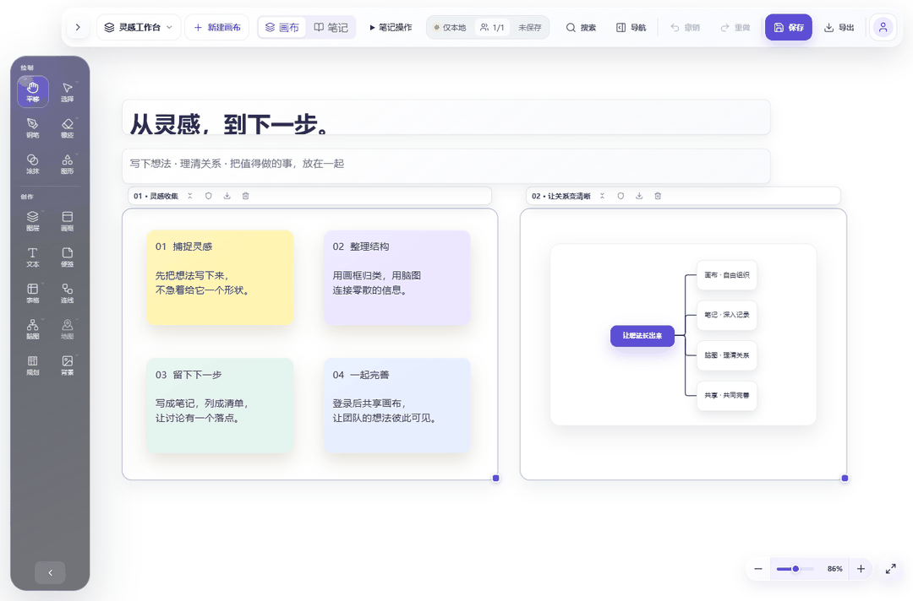
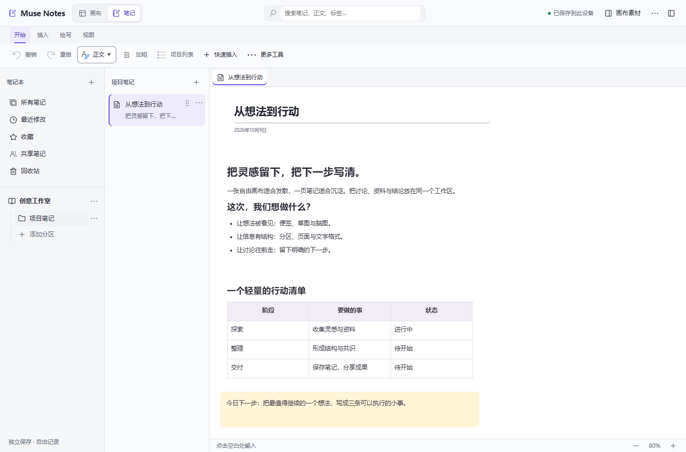

<div align="center">
  
  <h1>Museboard</h1>
  <p><strong>简体中文</strong> · <a href="README.en.md">English</a></p>
  <p><strong>把灵感、笔记与团队协作，放在同一个工作台。</strong></p>
  <p>自由画布 · 结构化笔记 · 脑图与连线 · 实时协作</p>
  <p>
    <a href="https://nodejs.org/en"></a>
    <a href="https://developer.mozilla.org/en-US/docs/Web/JavaScript/Guide/Modules"></a>
    <a href="https://www.sqlite.org/wal.html"></a>
    <a href="#quick-start"></a>
  </p>
  <p>
    <a href="https://github.com/commonDomain/board/stargazers"></a>
    <a href="LICENSE"></a>
    <a href="https://github.com/commonDomain/board/issues"></a>
  </p>
  <p>
    <a href="#quick-start">快速开始</a> ·
    <a href="#showcase">界面与动画</a> ·
    <a href="#features">核心能力</a> ·
    <a href="#configuration">功能开关</a> ·
    <a href="#documentation">文档导航</a>
  </p>
</div>

<p align="center">
  
</p>

Museboard 是一个可以自己部署的协作工作区。用便签与画笔捕捉想法，用脑图和连线表达关系，再用自由笔记留下资料、讨论与下一步。

<a id="showcase"></a>

## 界面与动画

<p align="center">
  
</p>

<p align="center"><sub>实际界面录制：浏览灵感画布 → 缩放查看关系 → 切换笔记与行动清单。演示使用隔离环境中的示例内容。</sub></p>

<details>
<summary><strong>展开查看画布与笔记的清晰截图</strong></summary>

### 画布：让零散的想法有位置

便签完整放在画框内，脑图在独立区域表达关系；保留明确的分组、留白与工具入口。


### 笔记：把讨论沉淀成可继续的内容

分区与页面管理资料，正文、列表和表格自由组合；画布素材可以复制到笔记中继续整理。



</details>

<a id="features"></a>

## 核心能力

| 能力 | 能做什么 | 适合怎样使用 |
| --- | --- | --- |
| **画布** | 压感画笔、便签、文字、图形、画框与图层 | 收集灵感、草图表达、视觉整理 |
| **笔记** | 分区、页面、富文本、表格、素材复制与区域引用 | 项目笔记、资料摘录、讨论沉淀 |
| **脑图** | 节点编辑、关系表达、智能路由、XMind / Markdown 导入 | 拆解思路、梳理结构、说明关系 |
| **协作** | 账号画布、共享组、在线光标、编辑锁与私有内容 | 同步讨论、共同修改、保留个人空间 |
| **规划** | 清单、看板、日历、任务来源与执行步骤 | 从整理信息走向安排下一步；需启用开关 |
| **保存** | SQLite 持久化、本地待提交队列、导出与完整备份 | 保存成果、断线恢复、自行管理数据 |

账号画布默认与同组成员共享，可切换为私有。游客数据只保存在当前浏览器，也可在登录后选择导入账号。

<details>
<summary>查看完整功能列表</summary>

- 无限画布、缩放和平移，支持鼠标、触控和压感笔输入
- Canvas 2D 压力笔刷引擎，包含多种有明显差异的笔刷、平滑、压力、颗粒、间距和不透明度参数
- 形状、文本、便签、表格、图片、连接线和选择/变换操作
- 图层的新建、删除、排序、显示、锁定、不透明度和混合模式
- 可编辑脑图，支持节点增删、编辑、折叠、XMind/Markdown 本地导入和可选的 XMind 官方 MCP 连接
- 背景预设与贴纸库；背景作为画板设置参与同步
- 桌面端站内二维码登录：手机扫码后使用本机 Passkey 登录并明确授权，Windows 页面不调用登录 Passkey，因此不会由本站触发 Windows Hello/USB 安全密钥选择器
- 标准 discoverable Passkey 注册、手机登录、凭证管理、14 天绝对会话和恢复码重置流程
- 账号画布服务端持久化；游客画布和图片 Blob 仅保存在当前浏览器，可选择性导入账号
- 共享码组成长期共享组（所有者 + 最多 4 名成员），共享画布实时协作，私密画布仅所有者可见
- 笔记列表支持右键共享单篇笔记，沿用画布的共享组；收藏下方的“共享笔记”入口汇总自己共享及成员共享的笔记，“所有笔记”中也会显示。列表用“已共享”或“来自成员”标识来源。成员可在取得单篇编辑锁后修改内容和标题，共享设置、移动及删除由笔记所有者管理；未共享的笔记和图片保持私有。
- 每个账号或游客最多拥有 10 块普通画布；共享组成员最多可看到 50 块普通画布及自己的操作指南，并保存各自的目录排序
- 每个账号和游客首次读取画布列表时会自动获得一份私有“操作指南”副本；已有账号和已有游客数据也会自动补齐，无需运行脚本。指南可独立编辑、重命名和删除；删除后不会再次自动创建。删除最后一块画布后进入创建画布引导页。指南不能共享，也不占用普通画布的 10 块额度。模板固定为 `public/guide-template.json` 中的内容，之后编辑某位用户的副本不会改变其他人的指南。
- 用户资料、头像、不可变账号 ID、成员锁扣链和取消共享确认；15 分钟无操作后显示隐私模糊锁
- WebSocket 实时协作、账号级 Presence 去重、在线光标、撤销/重做与手动保存
- 画框/分区：创建、拖动、调整尺寸、折叠、锁定子内容、导出和安全/级联删除
- 任意深度的嵌套分组；移动分组时保持整棵子树，解除分组只提升一级
- 内容导航器：按“画框 > 分组 > 对象”展示层级，支持定位、显隐、锁定、重命名、删除和画框拖拽排序
- 全局搜索：搜索全部目录画布中的文本、便签、画框和分组，并可安全切换画布后定位结果
- 导航工具：可在画布放置 2D 高德街道地图、地点搜索和路线规划卡片；搜索选点、定位和所选路线会作为画布状态实时共享
- 六种对齐、水平/垂直分布、网格布局、连接关系感知的横向/纵向流式布局；自动布局在 Worker 中计算
- 浏览器端空间索引用于视口裁剪、命中测试和吸附候选；服务端使用 FTS5 与 RTree 派生索引
- 响应式工具栏和弹出面板，移动端使用适合触控的底部工具区
- Resend 邮箱魔法链接注册、登录与邮箱绑定；邮件地址属于账号私密资料，不进入公开用户对象、共享组或 Presence

功能是否适用于具体业务流程，应以当前浏览器中的实际操作结果为准；本文不承诺未经自动化测试或真机测试覆盖的兼容性。

</details>

<a id="quick-start"></a>

## 快速开始

需要 **Node.js 24+** 和 npm。首次启动可直接使用本地游客模式。

```bash
git clone https://github.com/commonDomain/board.git
cd board
npm ci
cp .env.example .env
npm start
```

打开 **[http://localhost:4000](http://localhost:4000)**，选择“以游客身份继续”。

Windows PowerShell 中，将复制配置的命令改为 `Copy-Item .env.example .env`。`npm start` 会自动构建浏览器依赖和前端组件。

<details>
<summary>浏览器与设备要求</summary>

- Node.js 24 或更高版本（服务端使用内置 `node:sqlite`）
- 支持 WebAuthn、WebSocket、Canvas 2D 和 IndexedDB 的现代浏览器
- npm

界面提供桌面浏览器、手机浏览器和微信小程序 `web-view` 所需的响应式布局与触控交互；仓库不包含独立小程序工程。微信环境的行为仍受具体微信版本、系统 WebView 和存储配额影响，上线前应在目标真机上回归测试。

</details>

<a id="configuration"></a>

## 功能开关

先使用画布与笔记，再按需要接入可选功能。配置统一写在本机 `.env`，完整说明见 [配置模板](.env.example)。

| 功能 | 初始状态 | 如何启用 |
| --- | --- | --- |
| 游客画布与笔记 | 开启 | 无需第三方服务，数据保存到当前浏览器 |
| Passkey 与二维码授权 | 开启 | 本机使用 localhost；生产配置自己的 HTTPS 域名与 RP ID |
| 邮箱魔法链接 | 关闭 | 配置 Resend 后设置 `EMAIL_AUTH_ENABLED=1` |
| 内嵌规划 | 关闭 | 设置 `PLANNING_ENABLED=1`；见 [规划说明](docs/planning.md) |
| 高德地图 | 关闭 | 配置高德凭据后设置 `AMAP_ENABLED=1` |
| XMind 云端连接 | 关闭 | 配置令牌加密密钥后设置 `XMIND_MCP_ENABLED=1` |

<a id="documentation"></a>

## 文档导航

| 想了解什么 | 从这里开始 |
| --- | --- |
| 源码入口、模块职责、构建与检查 | [代码维护说明](docs/code-maintenance.md) |
| 画布与笔记的界面和架构 | [当前界面与架构](docs/current-ui-and-architecture.md) |
| 协作、操作队列与保存确认 | [同步机制](docs/sync-mechanism.md) |
| 连线、端点与兼容规则 | [连接线系统](docs/connector-system.md) |
| 规划组件与数据生命周期 | [规划说明](docs/planning.md) |
| 笔记存储、权限与恢复 | [笔记可靠性](docs/notes-workspace-reliability.md) |
| 手机与平板交互 | [移动端适配](docs/mobile-adaptation.md) |

<details>
<summary><strong>展开部署、配置与数据维护说明</strong></summary>

## 部署与配置

项目根目录的 `.env` 集中保存全部动态配置；该文件已加入 `.gitignore`，不会被提交。首次部署也可从 `.env.example` 复制一份后填写。`npm start` 会先构建浏览器端依赖包，再通过 Node.js 原生 `--env-file-if-exists=.env` 加载配置并启动服务；操作系统或进程管理器显式设置的同名环境变量优先于 `.env`。

默认监听 `0.0.0.0:4000`：

```text
http://localhost:4000/
```

生产 Passkey 依赖 HTTPS。部署到计划域名时使用：

```text
PUBLIC_BASE_URL=https://example.com/board/
PASSKEY_RP_ID=example.com
PASSKEY_EXPECTED_ORIGIN=https://example.com
ALLOWED_ORIGINS=https://example.com
```

邮箱注册和登录默认关闭；配置 Resend 后会成为登录弹窗的首选方式，Passkey 和恢复码收纳在“其他登录方式”中：

```text
EMAIL_AUTH_ENABLED=1
RESEND_API_KEY=re_...
RESEND_FROM=Museboard <login@example.com>
RESEND_WEBHOOK_SECRET=whsec_...
```

先在 Resend 验证与 `RESEND_FROM` 匹配的发信域名，创建仅用于发信的 API Key，并把 webhook 地址配置为 `https://example.com/api/webhooks/resend`。至少订阅 `email.sent`、`email.delivered`、`email.delivery_delayed`、`email.bounced`、`email.complained` 和 `email.failed`。webhook 端点不依赖浏览器 Origin，但每次请求都会用 Resend/Svix 签名和原始请求体校验；不要在 CDN 或代理层重写请求体。`RESEND_API_KEY` 与 `RESEND_WEBHOOK_SECRET` 只能存放在服务端密钥环境中。

魔法链接 15 分钟失效且只能确认一次，令牌只出现在 URL fragment，静态页面加载后立即从地址栏清除；数据库仅保存 SHA-256 哈希。邮件链接页只确认邮箱控制权，不创建会话、不设置登录 Cookie，也没有进入画板的入口。发起请求的标签页持有另一枚独立领取令牌并轮询确认状态，只有该页面可以创建会话；手机端若要登录，必须先在手机浏览器发起邮件。登录不会为未知邮箱静默创建账号，注册已存在邮箱会进入原账号，给当前会话绑定邮箱时也不会自动合并两个账号。若发起请求的浏览器已登录另一个账号，必须在原页面明确确认切换。

### 高德地图导航

导航能力默认关闭。需要在高德控制台分别创建 Web 端（JS API）Key 和 Web 服务 Key，为两者配置允许的域名/IP与数字签名，并填写：

```text
AMAP_ENABLED=1
AMAP_JS_KEY=你的 Web 端 Key
AMAP_JS_SECURITY_CODE=你的 JS API 安全密钥
AMAP_WEB_SERVICE_KEY=你的 Web 服务 Key
AMAP_WEB_SERVICE_PRIVATE_KEY=该 Web 服务 Key 的数字签名私钥
AMAP_USAGE_HASH_SECRET=至少32字符的独立随机密钥
```

开启时缺少任一密钥、匿名化密钥不足 32 字符或重置时区无效，服务会拒绝启动。JS Key 只进入登录后的同源沙箱地图框；JS 安全密钥由 `/_AMapService` 同源代理注入，不下发给浏览器；搜索、地址联想、定位和路径规划只由服务端签名调用。路线起点和终点输入停止 320 ms 后会显示最多 8 个带详细地址的候选项，可用鼠标、触摸或键盘选择；未选择候选时，提交路线仍会用完整文本搜索兜底。所有业务接口都要求登录、画布访问权限和 CSRF，额度同时按账号、HMAC 匿名化 IP 和全局三个维度记录。

默认每块画布每类只允许一个地图、搜索框和路线规划框，每个账号最多创建 3 个同类组件。搜索默认账号 40 次/日、800 次/月；规划 30 次/日、600 次/月；定位 50 次/日、1000 次/月。另有 IP、全局日/月额度、账号/IP 分钟限流、全局 QPS、并发、超时、响应大小、缓存与熔断配置；完整变量和默认值见 `.env.example`。额度耗尽或上游暂时不可用时，已保存的最后结果仍可只读查看。

### WPS 云文档嵌入（可选）

仓库附带 WPS WebOffice SDK 2.0.7，位于 `public/vendor/web-office-sdk-solution-v2.0.7.umd.js`，用于嵌入 WPS 云文档。使用方法见 [WPS 官方 SDK 文档](https://open.wps.cn/documents/app-integration-dev/docs-center/online-preview-edit/web/jssdk)。

### 脑图导入与 XMind MCP

`.xmind` 文件完全在浏览器 Worker 中解压和解析，支持新版 `content.json` 与 XMind 8 `content.xml`；原文件不会上传、缓存或写入 IndexedDB。Markdown 使用独立解析器。两类导入均限制文件体积、节点数和层级，且失败不会改动画板。

XMind 云端连接默认关闭，使用 XMind 官方 Streamable HTTP MCP、OAuth 授权码与 PKCE。用户可在国际版 `https://app.xmind.com/api/mcp` 和中文版 `https://app.xmind.cn/api/mcp` 之间选择；一个本站账号只保存一个站点的授权，切换成功后覆盖旧站点凭证。启用前生成独立的 32 字节密钥，并将其保存在服务端密钥环境中：

```text
XMIND_MCP_ENABLED=1
XMIND_TOKEN_ENCRYPTION_KEY=一段base64编码的32字节随机密钥
XMIND_TOKEN_ENCRYPTION_PREVIOUS_KEYS=轮换期间使用的逗号分隔旧密钥
```

访问与刷新令牌只以 AES-256-GCM 密文保存在账号记录中，不会进入浏览器、画板 JSON、共享成员响应或日志。共享成员可以看到已落入共享画板的内容，但只有完成相同站点授权的连接者能浏览远端最近列表、刷新或确认写回。读取时优先使用 MCP 的结构化主题、样式和关系数据；写回使用带稳定 ID 的 JSON 增量补丁，并对主题属性与样式调用可用的细粒度工具，之后回读校验结构。只有上游工具不提供指令式编辑时才回退到层级 Markdown。未在画板中修改的边界、概要、图片、附件、任务和未知字段会被明确要求原样保留。轮换时把新密钥设为主密钥并把旧密钥临时放入历史密钥列表；密钥应与数据库备份分开保存。完整超时和响应上限配置见 `.env.example`。

本机开发 Passkey 时将前四项分别改为 `http://localhost:4000/`、`localhost`、`http://localhost:4000`、`http://localhost:4000`。启动后先显示登录弹窗；桌面端创建账号、Passkey 登录和恢复均先展示站内二维码，手机相机扫码后用手机浏览器完成本机 Passkey，再点击“确认授权这台电脑”。二维码包含 6 位核对码，电脑和手机应显示一致；二维码 5 分钟失效且只能领取一次。也可明确选择游客身份继续。退出登录后不会自动进入游客空间。

二维码中的手机授权令牌位于 URL fragment，不会随静态页面请求发送；手机页面会立即把它移入当前标签页的 `sessionStorage` 并清除地址栏。电脑使用另一枚独立领取令牌轮询，数据库只保存两枚令牌的 SHA-256 哈希。

有效账号会加载其有权访问的画布。有共享画布时可直接进入；完全没有可访问画布时显示创建“画布 1”的引导。主动退出共享组或被组主移出后，若没有自己的画布，也会进入引导页，不会自动创建画布。旧的 `?board=` 和 hash 入口会被忽略，未入正式目录的历史记录不会自动开放。

画布目录接口：

- `GET /api/canvases`：读取按创建顺序排列的画布目录
- `POST /api/canvases`：以 JSON `{ "name": "名称" }` 创建画布
- `PUT /api/canvases/:id/preview`：写入 WebP 缩略图
- `GET /api/canvases/:id/preview?v=...`：读取版本化缩略图
- `GET /api/search?q=...&limit=...&cursor=...`：跨目录画布搜索，最多返回 50 条

画布名称会去除首尾空格，最长 30 个 Unicode 字符，并按大小写敏感的精确文本判重。每个账号最多拥有 10 块画布；共享组中的其他成员画布不占用本人的 10 块额度。

### 账号与游客数据边界

- 用户名是可重复的显示名称；`MB-…` 账号 ID 全局唯一且创建后不可修改。
- 恢复码只在创建或重新生成时显示一次，数据库只保存随机盐和 `scrypt` 哈希。
- 账号 REST、预览、资源和 WebSocket 请求均在服务端验证成员关系与画布可见性；切换私密会立即撤销其他成员连接。
- 游客模式不连接协作 WebSocket，也不请求服务端画布、搜索或资源接口。清除站点数据或换浏览器后无法找回游客数据。
- 游客登录成功后可选择导入本地画布；导入项默认为私密，服务端成功提交后才删除对应游客副本。

### v2 / v3 文档升级到 v4

服务端升级后首次启动时，会在单个 SQLite 事务中把目录画布文档从 v2、v3 或 v4 升级为 v5。每块画布的原始 JSON 会按来源版本只读保存在 `state_v2_archives`、`state_v3_archives` 或 `state_v4_archives`，用于审计和人工回滚；只在整批画布全部校验成功后提交。v5 增加共享的笔记、笔记排序、独立布局和画布待放置状态，同时保留原画布几何。任意画布损坏都会使迁移整体回滚并阻止服务启动，避免部分升级。搜索、空间、地图组件和资源引用派生数据按实现版本重建并写入标记，后续普通启动会跳过全库重建。

上线前仍应停止旧服务并完整备份 `DATA_DIR`。版本归档表不是生产备份的替代品，也不会包含数据库外部的历史环境配置。

### 笔记本模式

顶部“画布 / 笔记本”切换进入独立笔记工作区。笔记本、分区、页面与富文本内容独立保存；通过“画布素材”和“笔记原创内容”在两种模式之间复制内容，复制后分别编辑，不共享元素或坐标。已有笔记的自由排版在不同设备上保持不变，可通过适合页面、恢复 100%、滚动和缩放查看。

### 平板与手机操作

优先适配 iPad 和安卓平板，支持横竖屏与分屏；手机使用底部工具栏、可滚动菜单和目录抽屉。触控按钮及选择手柄扩大点击区域，缩放控件不覆盖工具栏。

- 画布和笔记均可双指移动、缩放。画布默认不随双指旋转，可在“触控设置”中开启，并使用“回正”恢复角度。
- 默认可用手指绘画；“仅手写笔绘制”开启后，绘写工具下手指用于浏览。设置在本机保存，两种模式共用。
- 笔记轻点空白处输入，滑动浏览；选中内容后使用移动或调整尺寸手柄。多选、完成编辑、取消操作和目录排序均有触控入口。
- 画布文字等放置工具通过轻点确认，滑动不会立即创建内容；选中后可用触控操作栏进入编辑或更多操作。
- 电子表格默认单指滚动，双击单元格输入；“拖动选择区域”可切换为区域选择，长按打开单元格菜单。
- 第二根手指加入绘写时，未完成笔画会取消并转为视图操作。系统取消手势时不提交未完成的笔画或变换。

实现和验证范围见 [移动端适配与验收](docs/mobile-adaptation.md)。浏览器触控模拟已覆盖主要交互；iPad/安卓真机的手写笔、系统输入法、文件选择与下载仍需设备验收。

PowerShell 下可这样临时指定配置：

```powershell
$env:PORT = '8080'
$env:DATA_DIR = 'D:\museboard-data'
npm start
```

## 数据可靠性

### 服务端：SQLite WAL 是唯一真源

所有 v4 画板状态都保存在 `DATA_DIR/whiteboard.sqlite`。数据库启用：

- WAL 日志模式
- `synchronous=FULL`
- 外键约束
- 写事务和 revision 比较交换

画布目录与预览同样保存在 SQLite 中。只有目录中的画布可以加入 WebSocket 协作房间；历史 `boards` 记录会保留，但不会通过旧 URL 入口重新开放。

每次有效操作都会在同一个事务里更新权威画板快照、操作记录、全文搜索文档与空间边界索引。服务端先完成事务提交，再向客户端广播提交结果；无效批量操作会整体拒绝，不会只写入一部分。状态 JSON 是恢复真源，FTS5/RTree 是可重建的派生索引，因此派生索引异常不会成为唯一的数据副本。

画框、分组、对象引用和父子关系均由服务端规范化并校验：无效引用、循环分组、超过最大嵌套深度、锁定内容修改和协议版本不一致都会被拒绝。级联删除会在同一提交中把跨边界连接线端点固定到删除前位置，避免悬空引用。

`data/whiteboard.sqlite-wal` 和 `data/whiteboard.sqlite-shm` 是 SQLite 正常运行时文件，不应在服务运行时单独复制、删除或修改。备份时优先停止服务后复制整个 `DATA_DIR`，或使用 SQLite 支持的在线备份方式。

### WebSocket v4 revision / opId 协议

客户端操作采用以下语义：

- `opId`：客户端生成的操作唯一标识；服务端以 `(boardId, opId)` 去重，重试不会重复应用
- `baseRevision`：客户端操作所基于的版本；不匹配时服务端拒绝提交，客户端请求最新快照后重放仍待确认的操作
- `revision`：每次成功提交严格递增
- `committed`：服务端提交成功后的权威确认，包含规范化操作和新 revision
- `snapshot` / `resync`：首次加入和版本冲突后的全量校准
- `save`：对当前已提交 revision 做检查点，并返回 `savedAt`

服务端按画板串行处理操作；操作记录和画板快照在同一 SQLite 事务中提交。

### 浏览器：IndexedDB outbox

未收到 `committed` 确认的操作保存在浏览器 IndexedDB 的 `museboard-client` 数据库中。断线或页面重载后，客户端会重新发送 outbox，服务端依靠 `opId` 保证幂等。

最近一次 v4 账号快照按 `userId + boardId` 隔离缓存在 IndexedDB 中，用于页面快速恢复；退出前会同步落盘待发送队列，退出登录或会话过期后仍保留在原账号的隔离恢复区，重新登录同一账号时继续同步，且绝不会复制到其他账号或游客空间。只有收到服务端提交确认后，对应 outbox 项才会删除。游客的目录、完整快照和图片 Blob 使用独立 IndexedDB 空间；IndexedDB 不可用时页面会提示当前仅为临时内存模式并提供导出入口。

浏览器缓存不是服务端数据的替代品；服务端 SQLite 始终是协作状态的唯一权威来源。

### HTTP 与服务端内存缓存

- HTML 使用 `no-cache` 和 ETag，每次打开都会确认当前构建；HTML 中的 JS、CSS、Worker 与 vendor URL 会自动加入整个前端构建的内容指纹，并使用一年期 `immutable` 缓存。发布新内容必须重启服务，以重新计算构建指纹。
- 画布预览仅在 URL 的 `v` 与当前预览版本一致时使用私有不可变缓存；无版本 URL 会继续重验证，过期版本不会返回新内容。图片资源使用 SHA-256 内容地址、`private` 缓存和 `Vary: Cookie`，不会进入共享代理缓存或跨会话复用。
- 服务端只缓存近期加载的画板状态。在线、有在途写入或正在删除的画板不会被淘汰；空闲画板按时间、条目数和估算字节数进行 LRU 淘汰，权威状态始终已提交到 SQLite。`GET /api/health` 的 `boardCache` 字段提供命中、未命中、淘汰和容量指标。

## 文档与协议边界

服务端只接受 WebSocket 协议 v4；旧客户端会收到明确的协议不匹配错误，必须刷新到新版前端。SQLite 中目录画布的 v2 / v3 文档会按前述事务迁移到 v4；目录外的历史临时画布既不会迁移开放，也不会被删除。旧 `?board=` 和 hash 仅被忽略，不再作为选择画布的入口。

## 数据目录

默认数据目录是项目根目录下的 `data`，可用 `DATA_DIR` 改到独立的持久化磁盘：

```text
data/
├── whiteboard.sqlite       # v4 权威状态、目录、操作、归档与派生索引
├── whiteboard.sqlite-wal   # SQLite WAL 运行时文件
├── whiteboard.sqlite-shm   # SQLite 共享内存运行时文件
├── assets/                 # 上传图片，按内容哈希去重
└── logs/                   # 当天登录审计日志 login-users-YYYY-MM-DD.log
```

`DATA_DIR` 应对运行服务的用户可写，并应纳入磁盘容量与备份监控。

## 环境变量

| 变量 | 默认值 | 说明 |
| --- | ---: | --- |
| `PORT` | `4000` | HTTP / WebSocket 端口 |
| `HOST` | `0.0.0.0` | 监听地址 |
| `DATA_DIR` | `<项目>/data` | SQLite 与资源目录 |
| `LOGIN_LOG_DIR` | `<DATA_DIR>/logs` | 登录审计日志目录；跨日后仅保留当天文件 |
| `LOGIN_LOG_TIMEZONE` | `Asia/Shanghai` | 登录日志按日切换使用的时区 |
| `API_PAYLOAD_ENCRYPTION_ENABLED` | `0` | 设为 `1` 后为同源 JSON API 启用应用层 AES-256-GCM；HTTPS 仍须保留 |
| `API_PAYLOAD_ENCRYPTION_KEY` | 空 | 服务端 32 字节 base64 主密钥；浏览器端不保存该密钥 |
| `API_PAYLOAD_ENCRYPTION_SESSION_TTL_MS` | `600000` | ECDH/HKDF 派生的临时接口加密会话有效期 |
| `API_PAYLOAD_ENCRYPTION_MAX_SESSIONS` | `10000` | 服务端最多保留的接口加密会话数 |
| `API_PAYLOAD_ENCRYPTION_CLOCK_SKEW_MS` | `60000` | 加密请求允许的时间偏差及重放 nonce 窗口 |
| `MAX_ENCRYPTED_API_PAYLOAD` | `100663296` | 加密请求信封最大字节数 |
| `PUBLIC_BASE_URL` | `http://localhost:4000/` | Passkey 公网基准 URL |
| `PASSKEY_RP_ID` | `PUBLIC_BASE_URL` 的主机名 | WebAuthn RP ID，不含协议与路径 |
| `PASSKEY_EXPECTED_ORIGIN` | `PUBLIC_BASE_URL` 的 Origin | WebAuthn 精确 Origin |
| `PASSKEY_RP_NAME` | `Muse Board` | 浏览器展示的 RP 名称 |
| `PASSKEY_AUTH_ENABLED` | `1` | Passkey 登录、注册、恢复与管理总开关 |
| `REGISTRATION_ENABLED` | `1` | 所有新账号创建总开关；不影响已有账号登录 |
| `GUEST_MODE_ENABLED` | `1` | 登录页游客入口开关 |
| `SHARING_ENABLED` | `1` | 共享管理和跨账号共享画布访问总开关 |
| `SHARING_MAX_MEMBERS` | `5` | 单个共享组成员上限 |
| `SESSION_TTL_MS` | `1209600000` | 登录会话绝对有效期（14 天） |
| `MAX_SESSIONS_PER_ACCOUNT` | `20` | 单账号同时保留的有效会话上限；超限淘汰旧会话 |
| `MAX_PASSKEYS_PER_ACCOUNT` | `10` | 单账号可保存的 Passkey 上限 |
| `AUTH_CHALLENGE_TTL_MS` | `600000` | Passkey 一次性挑战有效期 |
| `RECENT_AUTH_TTL_MS` | `300000` | 新增登录方式前的一次性、会话及操作绑定身份确认有效期 |
| `DEVICE_PAIRING_TTL_MS` | `300000` | 手机扫码授权有效期 |
| `EMAIL_AUTH_ENABLED` | `0` | 设为 `1` 后启用 Resend 邮箱注册、登录和绑定 |
| `RESEND_API_KEY` | 空 | Resend 服务端 API Key；启用邮箱认证时必填 |
| `RESEND_FROM` | 空 | 已在 Resend 验证的发件人，如 `Museboard <login@auth.example.com>` |
| `RESEND_REPLY_TO` | 空 | 可选的回复地址 |
| `RESEND_WEBHOOK_SECRET` | 空 | Resend webhook 签名密钥；启用邮箱认证时必填 |
| `RESEND_MAX_ATTEMPTS` | `3` | 瞬时投递故障的最多发送尝试次数 |
| `RESEND_RETRY_BASE_MS` | `350` | Resend 指数退避的基础等待时间 |
| `RESEND_REQUEST_TIMEOUT_MS` | `10000` | Resend 单次网络请求超时 |
| `EMAIL_LINK_TTL_MS` | `900000` | 魔法链接有效期，服务端限制在 1–60 分钟 |
| `EMAIL_RESEND_COOLDOWN_MS` | `60000` | 同邮箱、同用途的重发冷却时间，服务端限制在 10 秒–60 分钟 |
| `EMAIL_HOURLY_LIMIT` | `5` | 单邮箱每小时发送上限 |
| `EMAIL_REQUEST_RETENTION_MS` | `86400000` | 邮箱认证请求记录保留期 |
| `RESEND_EVENT_RETENTION_MS` | `2592000000` | Resend webhook 事件去重记录保留期 |
| `MAX_CLIENTS_PER_BOARD` | `25` | 单画板最大 WebSocket 连接数；Presence 仍按账号去重 |
| `MAX_WEBSOCKET_CLIENTS` | `500` | 全服务 WebSocket 连接总上限 |
| `MAX_ASSET_SIZE` | `15728640` | 单个上传资源最大字节数 |
| `MAX_IMAGE_PIXELS` | `80000000` | 单张图片解码像素上限（防解压炸弹） |
| `MAX_AVATAR_SIZE` | `5242880` | 头像上传最大字节数 |
| `MAX_AVATAR_PIXELS` | `20000000` | 头像输入最大解码像素数 |
| `AVATAR_OUTPUT_SIZE` | `256` | 头像输出宽高像素 |
| `AVATAR_UPLOAD_RATE_LIMIT` | `6` | 单账号及单 IP 在头像窗口内允许的处理次数 |
| `AVATAR_UPLOAD_RATE_WINDOW_MS` | `60000` | 头像专用限流时间窗 |
| `IMAGE_PROCESSING_CONCURRENCY` | `2` | Sharp/libvips 图片处理线程数 |
| `MAX_CANVASES` | `10` | 单账号或游客画布上限 |
| `MAX_CANVAS_NAME_LENGTH` | `30` | 画布名称最大 Unicode 字符数 |
| `MAX_PREVIEW_SIZE` | `524288` | 单个画布预览最大字节数 |
| `MAX_BOARD_ITEMS` | `5000` | 单画板最大元素数 |
| `MAX_SECTIONS` | `500` | 单画板画框上限 |
| `MAX_GROUPS` | `1000` | 单画板分组上限 |
| `MAX_GROUP_DEPTH` | `16` | 分组嵌套深度上限 |
| `SEARCH_RESULT_LIMIT` | `50` | 单次搜索结果上限 |
| `MAX_STATE_BYTES` | `25165824` | 单画板序列化状态最大字节数 |
| `BOARD_CACHE_MAX_ENTRIES` | `100` | 服务端已加载画板缓存条目软上限；在线或有在途写入的画板不会被淘汰 |
| `BOARD_CACHE_MAX_BYTES` | `268435456` | 服务端画板缓存总字节软上限 |
| `BOARD_CACHE_IDLE_MS` | `900000` | 无客户端画板的缓存空闲寿命 |
| `BOARD_CACHE_SWEEP_MS` | `60000` | 服务端画板缓存扫描间隔 |
| `MAX_MESSAGE_SIZE` | 自动计算 | WebSocket 消息上限 |
| `MAX_CLIENT_QUEUE_BYTES` | `33554432` | 单客户端发送缓冲上限 |
| `MAX_CLIENT_INBOUND_QUEUE_BYTES` | `50331648` | 单客户端尚待处理的入站消息累计字节上限 |
| `MAX_CLIENT_INBOUND_MESSAGES` | `64` | 单客户端尚待处理的入站消息数量上限 |
| `HEARTBEAT_INTERVAL_MS` | `30000` | WebSocket 心跳间隔 |
| `MAX_HTTP_CONNECTIONS` | `1000` | HTTP 并发连接总上限 |
| `MAX_REQUESTS_PER_SOCKET` | `100` | 单个 keep-alive 连接最多处理的请求数 |
| `HTTP_HEADERS_TIMEOUT_MS` | `15000` | HTTP 请求头接收超时 |
| `HTTP_REQUEST_TIMEOUT_MS` | `30000` | HTTP 请求接收超时 |
| `HTTP_KEEP_ALIVE_TIMEOUT_MS` | `5000` | 空闲 keep-alive 连接保留时间 |
| `MAX_DATA_DIR_BYTES` | `21474836480` | `DATA_DIR` 软容量上限；达到后暂停新增写入 |
| `MIN_FREE_DISK_BYTES` | `1073741824` | 文件系统最小剩余安全空间 |
| `MAX_PROCESS_RSS_BYTES` | `805306368` | Node 进程 RSS 软上限；超限时先清理空闲画板缓存 |
| `RESOURCE_MONITOR_INTERVAL_MS` | `60000` | 内存和磁盘安全水位扫描间隔 |
| `JOIN_TIMEOUT_MS` | `10000` | WebSocket 加入画板超时 |
| `OPS_RATE_LIMIT` | `30` | 每客户端每秒操作成本上限 |
| `SAVE_RATE_LIMIT` | `2` | 每客户端每秒保存次数上限 |
| `SEARCH_RATE_LIMIT` | `100` | 每 IP 每 10 秒的全局搜索次数上限 |
| `SEARCH_RATE_WINDOW_MS` | `10000` | 搜索限流时间窗 |
| `ASSET_UPLOAD_RATE_LIMIT` | `30` | 每 IP 每分钟的图片上传次数上限 |
| `ASSET_UPLOAD_RATE_WINDOW_MS` | `60000` | 上传限流时间窗 |
| `ASSET_UPLOAD_CONCURRENCY` | `4` | 服务端同时处理的上传请求数上限 |
| `ASSET_UPLOAD_GRANT_TTL_MS` | `600000` | 上传资源临时引用授权有效期 |
| `API_WRITE_RATE_LIMIT` | `300` | 每 IP 每分钟的账号/API 写入请求上限 |
| `API_WRITE_RATE_WINDOW_MS` | `60000` | API 写入限流时间窗 |
| `AUTH_RATE_LIMIT` | `30` | 每 IP 每 10 分钟的认证流程请求上限 |
| `AUTH_RATE_WINDOW_MS` | `600000` | 认证限流时间窗 |
| `SESSION_READ_RATE_LIMIT` | `120` | 单 IP 在会话读取窗口内允许的检查次数 |
| `SESSION_READ_RATE_WINDOW_MS` | `60000` | 会话读取内存限流时间窗 |
| `TRUSTED_PROXY_IPS` | `127.0.0.1,::1,::ffff:127.0.0.1` | 允许提供可信 `X-Forwarded-For` 的代理源 IP |
| `OP_RETENTION_MS` | `2592000000` | 操作记录保留时长（30 天） |
| `OP_RECEIPT_LIMIT` | `10000` | 单画板最多保留的操作回执数 |
| `MAINTENANCE_INTERVAL_MS` | `3600000` | 操作历史清理周期 |
| `ACCOUNT_CLEANUP_INTERVAL_MS` | `60000` | 过期认证数据后台清理周期 |
| `OPERATION_MAINTENANCE_ENABLED` | `1` | 操作历史定时清理开关 |
| `ASSET_GC_MIN_AGE_MS` | `604800000` | 孤儿资源保留时长（7 天） |
| `ASSET_GC_INTERVAL_MS` | `21600000` | 孤儿资源清理周期 |
| `ASSET_GC_ENABLED` | `1` | 孤儿资源自动清理开关 |
| `BACKUP_INTERVAL_MS` | `86400000` | 自动在线备份周期（24 小时） |
| `BACKUP_RETENTION_COUNT` | `7` | 保留的备份份数 |
| `BACKUP_INITIAL_DELAY_MS` | `5000` | 启动后首次备份延迟 |
| `AUTOMATIC_BACKUPS_ENABLED` | `1` | 自动在线备份开关 |
| `SNAPSHOT_CHUNK_THRESHOLD_BYTES` | `4194304` | 超过此大小改用分片快照 |
| `SNAPSHOT_CHUNK_BYTES` | `262144` | 分片快照的单个分片字节数 |
| `HSTS_MAX_AGE_SECONDS` | `0` | 启用 HSTS 的秒数（`0` 关闭；仅 HTTPS 部署时开启） |
| `PRIVACY_LOCK_IDLE_MS` | `900000` | 登录后无操作触发隐私遮罩的时间 |
| `SHUTDOWN_GRACE_MS` | `10000` | 优雅关停等待在途任务的最长时间 |
| `ALLOWED_ORIGINS` | `PUBLIC_BASE_URL` 的 Origin | 逗号分隔的精确 Origin；不能包含 `/board` 路径 |
| `AMAP_ENABLED` | `0` | 高德地图导航总开关；启用时所有密钥必须完整 |
| `AMAP_MAX_NAV_ITEMS_PER_USER` | `3` | 单账号可创建的每类导航组件上限 |
| `AMAP_ACCOUNT_RATE_PER_MINUTE` | `20` | 单账号每分钟导航 API 请求上限 |
| `AMAP_IP_RATE_PER_MINUTE` | `40` | 单匿名化 IP 每分钟导航 API 请求上限 |
| `AMAP_GLOBAL_QPS` | `5` | 全服务导航 API 每秒请求上限 |

### 功能开关与默认值

`.env` 中所有非密钥项都已填写与代码内一致的安全默认值；删除大多数项目或把数值项留空时，服务端仍会使用内置默认值。`ALLOWED_ORIGINS=` 空值是有意支持的特殊配置，表示关闭严格 Origin 白名单，仅适合受控测试环境；`TRUSTED_PROXY_IPS=` 空值表示不信任任何代理转发的客户端 IP。`RESEND_API_KEY` 和 `RESEND_WEBHOOK_SECRET` 不存在安全的伪默认值，因此保持为空，相应供应商能力默认不启用。修改 `.env` 后需要重启服务，配置会在进程启动时校验并生效。

- `REGISTRATION_ENABLED=0`：阻止邮箱和 Passkey 创建新账号，已有账号仍可登录。
- `PASSKEY_AUTH_ENABLED=0`：前端隐藏 Passkey，相关注册、登录、恢复和管理接口同时拒绝请求。
- `GUEST_MODE_ENABLED=0`：隐藏新的游客入口；不会删除浏览器中已有的游客数据。
- `SHARING_ENABLED=0`：隐藏并关闭共享管理；重启后跨账号共享画布访问也会被隔离，但不会删除已有共享组或画布。
- `AMAP_ENABLED=0`：前端保留导航入口并提示未配置，地图框和外部调用保持关闭；不会删除已有导航结果。
- `AUTOMATIC_BACKUPS_ENABLED`、`ASSET_GC_ENABLED`、`OPERATION_MAINTENANCE_ENABLED`：分别控制在线备份、孤儿资源清理和操作历史清理定时任务。

协议版本、数据库结构版本、密码学算法、Cookie 安全属性、CSP、安全来源校验规则以及允许的文件/MIME 类型刻意不做成动态开关。这些属于安全或兼容性不变量，开放为环境变量会使错误配置直接破坏数据兼容或降低安全边界。

健康检查：

```text
GET /api/health
```

响应会报告服务状态、存储类型 `sqlite-wal`、在线画板/客户端数量和运行时间。

## 开发与验证

```bash
npm run build
npm run check
```

`npm run build` 构建浏览器依赖和前端组件；`npm run check` 检查语法、未声明变量和前后端模块依赖。项目已移除测试脚本和历史验证产物。

`frontend/` 中的表格、账号、画笔与样式源码通过 `npm run build:frontend` 输出到 `public/`，不要直接编辑带有 Generated 标记的产物。`public/app/` 使用原生 ES 模块，无需单独打包。模块职责、状态归属与构建入口见 [代码维护说明](docs/code-maintenance.md)。

## 故障恢复

### 页面断线或意外关闭

1. 不要清理站点数据。
2. 重新打开网站并从顶部目录进入对应画布。
3. 客户端会载入 v4 本地快照并重发未确认 outbox。
4. 若 revision 冲突，客户端会获取服务端快照再重放待确认操作。

### 服务进程异常退出

重新运行 `npm start`。SQLite 会利用 WAL 恢复已提交事务；未完成的事务不会成为可见状态。可通过 `/api/health` 确认服务恢复。

### 数据库损坏或磁盘故障

1. 停止服务，避免继续写入。
2. 完整保留当前 `DATA_DIR` 供排查，不要只保留主数据库文件。
3. 从最近一次经过验证的整目录备份恢复到新的 `DATA_DIR`。
4. 使用新目录启动服务，并先执行健康检查和测试画板验证。

项目只使用严格 v2 在线备份：服务端每 `BACKUP_INTERVAL_MS`（默认 24 小时）通过 SQLite 在线备份 API生成同名 `.sqlite`、`.assets.json` 和 `.assets` 独立资源目录，逐个校验原图 SHA-256，并把 `.sqlite` 最后发布为完成标记。启动后 `BACKUP_INITIAL_DELAY_MS`（默认 5 秒）内执行首次备份，并按 `BACKUP_RETENTION_COUNT`（默认 7 份）轮换清理。旧版清单不会参与恢复，也不会阻塞服务启动；损坏的 v2 清单会暂停资源 GC，避免误删。恢复命令只接受完整 v2 包：

```powershell
npm.cmd run recover:backup -- --backup "D:\museboard-data\backups\whiteboard-时间.sqlite" --target-data-dir "D:\museboard-recovery"
```

生产部署仍应配置异地备份、恢复演练、磁盘告警和进程守护；自动备份不能替代这些措施。

## 目录结构

```text
backend/server.js       服务启动入口
backend/server/         HTTP 路由、WebSocket、操作校验、持久化与启动装配
backend/account-service.js 邮箱、Passkey、会话、恢复码和共享组领域逻辑
backend/email-service.js Resend 投递、重试、邮件模板与 webhook 验签
backend/amap-service.js 高德 Web 服务签名、规范化、缓存、限流、额度与熔断
public/index.html       应用壳层
public/pair.html        手机扫码后的 Passkey 授权页
public/email-auth.html  仅确认邮箱控制权的魔法链接结果页
frontend/styles/        按界面功能组织的样式源码
public/styles.css       构建后的完整样式
public/email-auth.css   邮箱回调页响应式样式
public/pair.css         手机授权页响应式样式
public/app.js           客户端模块加载入口
public/app/             画板、笔记、目录、历史、同步与连接线功能模块
frontend/               表格、账号、画笔等浏览器组件源码
public/amap-frame.js    同源沙箱中的高德 JS API 地图运行时
public/account.js       账号、游客导入、资料、共享链和隐私锁交互
public/pair.js          二维码核对、手机认证和电脑授权交互
public/email-auth.js    邮箱确认令牌提交和结果状态交互
public/brush-engine.js  Canvas 压力笔刷引擎
public/spatial-index.js 浏览器端空间网格索引
public/layout-worker.js 确定性网格/流式布局 Worker
public/sync-queue.js    严格顺序、可重基的客户端操作队列
public/storage.js       账号隔离缓存、IndexedDB outbox 与游客画布
scripts/build-vendor.js 浏览器依赖构建
scripts/build-frontend.js 浏览器组件与样式构建
data/                   默认 SQLite、WAL、资源与自动备份
```

## 反向代理

应用不再依赖 `?board=demo`。如果公网入口是 `/board/`，可使用下面的配置；把上游地址替换为实际服务。`location = /board` 只做末尾斜杠规范化，不能再追加 `?board=demo`。

```nginx
location = /board {
    return 308 /board/;
}

location ^~ /board/ {
    proxy_pass http://127.0.0.1:4000/;
    proxy_http_version 1.1;
    proxy_set_header Host $host;
    proxy_set_header X-Forwarded-Host $host;
    proxy_set_header X-Real-IP $remote_addr;
    proxy_set_header X-Forwarded-For $remote_addr;
    proxy_set_header X-Forwarded-Proto $scheme;
    proxy_connect_timeout 5s;
    proxy_read_timeout 60s;
}

location = /ws {
    proxy_pass http://127.0.0.1:4000;
    proxy_http_version 1.1;
    proxy_set_header Host $host;
    proxy_set_header Upgrade $http_upgrade;
    proxy_set_header Connection "upgrade";
    proxy_set_header X-Forwarded-Host $host;
    proxy_set_header X-Real-IP $remote_addr;
    proxy_set_header X-Forwarded-For $remote_addr;
    proxy_set_header X-Forwarded-Proto $scheme;
    proxy_read_timeout 3600s;
    proxy_send_timeout 3600s;
    proxy_buffering off;
}

location ^~ /api/ {
    proxy_pass http://127.0.0.1:4000;
    proxy_http_version 1.1;
    client_max_body_size 80m;
    proxy_set_header Host $host;
    proxy_set_header X-Forwarded-Host $host;
    proxy_set_header X-Real-IP $remote_addr;
    proxy_set_header X-Forwarded-For $remote_addr;
    proxy_set_header X-Forwarded-Proto $scheme;
    proxy_connect_timeout 5s;
    proxy_read_timeout 60s;
}

location ^~ /assets/ {
    proxy_pass http://127.0.0.1:4000;
    proxy_http_version 1.1;
    proxy_set_header Host $host;
    proxy_set_header X-Forwarded-Host $host;
    proxy_set_header X-Real-IP $remote_addr;
    proxy_set_header X-Forwarded-For $remote_addr;
    proxy_set_header X-Forwarded-Proto $scheme;
    proxy_connect_timeout 5s;
    proxy_read_timeout 60s;
}
```

不要同时保留一个专门为 `/board/` 追加 `?board=demo` 的精确匹配块；它会造成重复跳转并让旧参数继续出现在地址栏。若 Tailscale Serve 或其他上游要求固定 `Host`，将上面各块的 `proxy_set_header Host $host` 改成那个固定主机名，但仍保留 `X-Forwarded-Host $host` 传递真实公网域名。

生产环境还应使用 HTTPS、限制 `ALLOWED_ORIGINS`，并为 `DATA_DIR` 配置持久化、备份与容量监控。

## 公网部署加固

应用默认以 `http://localhost:4000/` 为本机开发入口并启用来源校验。生产部署使用自己的 HTTPS 域名，并同步修改 `PUBLIC_BASE_URL`、`PASSKEY_RP_ID`、`PASSKEY_EXPECTED_ORIGIN` 和 `ALLOWED_ORIGINS`，否则认证或写入会被拒绝：

- **`ALLOWED_ORIGINS` 严格模式**：配置该变量后，只接受白名单内的 `Origin`：
  - WebSocket 握手必须携带 Origin 且在白名单内；
  - HTTP 写操作（POST/PUT/PATCH/DELETE）必须携带 Origin 且在白名单内（浏览器同源写请求总是携带 Origin，页面功能不受影响；curl/脚本等无 Origin 的调用会被拒绝，属于预期行为）；
  - 无 Origin 的 GET/HEAD（同源列表、图片、预览）不受影响；携带非法 Origin 的请求一律 403。
  - 白名单必须包含**所有**实际访问 Origin（协议、主机和可选端口），不能包含 `/board` 路径。
- **HTTPS 与 `HSTS_MAX_AGE_SECONDS`**：使用 HTTPS 时设置该变量（如 `31536000`），浏览器会强制后续访问走 HTTPS；纯 HTTP 内网或未使用 HTTPS 时**不要**设置（会让浏览器把该主机强制记为 HTTPS 而无法访问）。
- 内置限流默认生效：认证每 IP 每 10 分钟 30 次、账号/API 写入每 IP 每分钟 300 次、全局搜索每 IP 每 10 秒 100 次，图片上传每 IP 每分钟 30 次且同时在途最多 4 个。
- 邮箱请求还按标准化邮箱单独限流：同邮箱同用途默认 60 秒冷却、每小时最多 5 次；已签发的同用途旧链接会失效。Resend 短暂故障会有限重试，持久失败不会把链接标记为已发送。
- Resend webhook 使用签名校验、事件 ID 幂等和事件时间排序；邮件投递状态只用于运维追踪，不改变已经建立的账号身份或会话。
- 服务端只接受 `TRUSTED_PROXY_IPS` 中代理提供的 `X-Forwarded-For`；如果 Nginx 不是从本机回环地址连接上游，请把它的实际源 IP 加入该列表，不要使用任意地址通配。
- 安全响应头已包含 CSP（`object-src 'none'`、`base-uri 'self'`、`frame-ancestors 'self'` 等）与 `X-Frame-Options: DENY`。
- 所有账号写接口同时要求有效会话、session-bound CSRF token 和严格 Origin。会话 Cookie 使用 `HttpOnly; Secure; SameSite=Lax; Path=/`，签发 14 天后绝对过期。


</details>

## 许可证

Copyright 2026 pengyiming。Museboard 的原创代码与文档采用 [Apache License 2.0](LICENSE)，允许使用、修改与商业用途；分发时须遵守许可证中的保留声明、标明修改等要求。版权声明见 [NOTICE](NOTICE)。

第三方组件与素材沿用各自的授权条款，项目的 Apache-2.0 不替代这些条款。GSAP 使用其 Standard License。组件声明见 [第三方许可说明](THIRD_PARTY_NOTICES.md)，素材来源见 [背景素材说明](public/backgrounds/README.md)。
